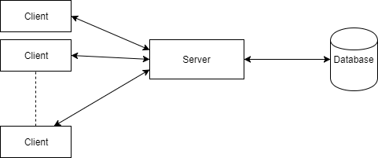

# Development Plans

The goals for this game are not to create something that is played by everyone on the planet, but simply a fun project. With this in mind we will not be prioritizing scaling, but instead performance, reliability and security. 

This MMO architecture [blog post](https://www.ibm.com/developerworks/library/ar-powerup1/index.html) is a good read if you would like to know a bit more about the layout and what kind of system is involved in building an MMO. 



The basic tech outline is pretty straight forward, we will be using PhaserJS to handle the clients actions, sending those over websocket to our Phoenix/Elixir server. The server handles the commands and sends that to the Postgres database where information is permanently stored. Once that transaction is complete to the DB we then send that information back and will update what the player has done to the original client and all of the other clients. **This should later be all of the clients that are relevant**, but for now we will just send messages either to the original client or all of the clients attached to the server.

## Todos

There isn't really any specified to do list, please check out the [repos issues](https://github.com/lego/elixir-mmo/issues) for suggestions of things you could work on or add problems/suggestions of your own. If there is anything that you want to work on submit a bit of info about how you plan on doing it, how it fits into the project and have fun!

My thoughts on how we should proceed are as follows:

1. Get Server/Client set up correctly and reliably for movement
2. Add attacks and stats to the game
3. Add monsters to use the attacks on
4. Build up the world, maps, enemies, etc
5. Implement Login so accounts can be saved
6. Add loot and an economy system
7. Add crafting/softskills
8. Create dynamic pve events
9. Add dungones or PVP, whichever seems to be needed at the time

Again, this plan does not need to be followed exactly and is VERY ROUGH to be implemented over the next year or so. Feel free to add bits and pieces of whatever you find interesting!

## Actions and Client - Server - DB Communication

Because of the amount of players in an MMO it is important to put a lot of the weight on to the client. In order to do this I would like to develop a good system involving actions. When the player loads into the game we will take a snapshot of their current player from the DB and save that client side. From here, we will only access the DB to make sure things are consistent and to update things. 

When the client performs an action, for example move up, the client will be moved to the new position if it is possible. If it is not possible all communication is ended here and the server is not notified. If they do successfully move up then we send a message to the server of the action performed and the parameters to that function. The server processes the events and updates the database accordingly. We then send back confirmation to the client from the DB saying that the operation was successful or not. If the operation was successful nothing happens and we just check that the players new coordinates are correct. If the operation failed then we return the last known good coordinates the player was at and the client updates to that position. Also upon successful completion we send out a message to all other clients to perform the same task on that player ID. 

Overall this keeps up consistency with clients and DB while also giving immediate feedback to the client as they only have to wait for a response if the response fails. We also keep most of the computation on the client side as all of the clients update their local copies separately while the server just deals with giving out the actions and storing information in the DB.

Psuedocode:

```
# Client:
performAction(player_id, args) do
	updateLocalPlayer(args);
	updateServer(player_id, action, args);
	
receiveMessage(msg) do
	if(currentPlayer == msg.player_id) do
		checkCorrect(msg.args)
	else
		# use the same action with the same args on the local player
		localPlayers[msg.player_id].(msg.action)(args);
# Server
receiveMessage(player_id, action, args) do
	if (update_player_in_DB(player_id, args))
		for each player p in players do
			p.sendMessage(player_id, action, args)
	else
		players[player_id].sendMessage(player_id, action, args, failed)
	

	
```

## Players

### Stats

This is mentioned in the [overview](overview.md) a bit, but players should have base stats of: Strength, Dexterity, Constitution, Intelligence and Wisdom. They will also have secondary skills involving Armor, Physical Damage, Crafting/Gathering speed etc. We want a robust system such that all equipment and enchantments can be applied to these stats and used when needed. It would be best to implement some kind of module system, on equip we look through the stats on the equipment and apply those as a bonus to our players. The first idea I had was to check through what is in our inventory and apply those bonuses upon needing them, however this would be very expensive since we would have to loop through all of this. Instead we should be applying the bonuses on equip and un-equip of the items. This works as long as the items are not changed while the player has them equipped. So for enchantments and such on weapons we will have to take them out of your equipped inventory and just put it in your inventory to enchant etc. This seems like a pretty fair thing to do to the players and also gives us a bit more consistency.

### Combat

I am currently not planning any kind of crazy combat system, but will have to eventually to make it fun. For now I would like to model the system off of what I know about Super Smash Bros Melee. There are hurt boxes and hitboxes for each player or creature which do as you would think. When the player attacks they launch out a hitbox in the form of a sword, or fireball etc that is still linked to the player that attacked by player_id. When a hurtbox comes in contact with a hitbox we apply damage to the character's hitbox using data from the hurtbox. Hurt and hitboxes should be the only dynamic collision boxes in the game.

For every hurtbox vs hitbox interaction we must be very careful for what happens on the server as this can make players very frustrated. I have two different ideas and will explain the pros and cons of both. When making this system please update which one was chosen, if either.

1. When we get a hit vs hurtbox interaction on a client, check the other clients involved and see if this is consistent with what is happening on theirs. If both clients report back that a hit did occur, then we update the server with the results from the interaction.

   Pros: This is relatively easy to implement, only makes things happen when both players see it happen, requires no work from the server to check and keep track of hit/hurtboxes

   Cons: One player may be lagging and this could cause strange interactions, such as nothing ever hitting them, could fool the server by doing some client side hacking and sending bogus messages, there are two failpoints instead of one master (the server)

2. For each hurtbox and hitbox attach it to an item in our DB. Have the server keep track of the position of these items, their speed and the time that they have existed for. When the client sends a message saying a hit occurred between two things, check if that simulation also happened on the server then make the appropriate action occur on the client, which then sends another message to the server to update the stats like health etc.

   Pros: This is much more reliable as we have one point of failure, the server which is going to be fair for both players.

   Cons: Much harder to implement, more messages for the server to be receiving, more work for the server to compute and keep track of all hit and hurtboxes. Since the server does not have a version of phaser running on it checking for collisions is difficult.

I would rather use **1** for now until we have a a better way to update information on the server, or can keep track of the information of hit/hurtboxes better.

## Testing

Please test code written on the server and make sure that `mix tests` succeeds before committing. For PhaserJS and client code I am not too worried, just make sure you write out edge cases you have tested for in your PRs. Games are very hard to test and since this is just a pet project I am expecting frontend bugs will be caught or not be too much of an issue. The security/DB consistency is more important.

