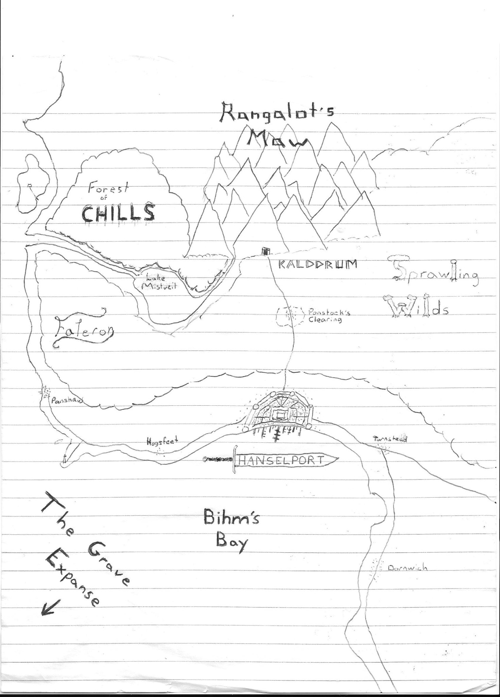

# Premise

The objective is to build up a mmo using new technologies. We will be using Elixir/Phoenix for the backend and PhaserJS for the frontend. Communication between them occurs with websockets and data is persisted in Postgres.

Realm of the Mad God (ROTMG) was the original creative benchmark for the game as it has the ability to both hold players for short and long periods of time due to being a roguelite. While ROTMG is mostly about going out in to the world with a huge party fighting in a bullet hell game getting loot to empower your character and trying to earn fame through killing world bosses.

For this game we would like to recreate the quick playability of ROTMG by having it also be a roguelite. You will live out the life of a character of your family. The family name is linked to the name of your actual account and items and money that is saved can be passed down to future family members. In the main world characters will be able to do very simple life skills including mining, smelting, alchemy, survival (fishing, woodcutting, etc). There will be no gates on players and what they can or can't do in the game. If they find a very high level equipment or enchantment they are welcome to use it. The gate on items will be based off of how powerful they are. Higher level items will be controlled by higher level players and monsters. 

The world will be a main city where players start and live, as they travel farther out of the starting city things will get more dangerous, but the rewards will be greater. There will be temporary cities throughout the world that will allow players to be safe in between the perilous wilds. Players will be able to help each other out as they venture through the world. Dynamic events will also occur throughout the world that players will be able to interact with the feel like they are contributing to the world. 

The main game loop will be to adventure into the world and level up your character through items which you can either find, build yourself or buy from other players. The players goal is to earn fame for their family by a combination of money, fame from killing monsters and helping with events. Age may eventually be added the the game to give people an end point for their characters as you must do what you need before you die of old age. When you do finally die either by age or monsters or the other traps that are within the game you will respawn as a new person from your family and continue on your legacy.

# Characters

## Stats

Stats that players have are determined on character spawn and stay with them until they create a new character upon death.

* Strength - Physical Damage, mining, woodcutting
* Dexterity - Natural Armor, fishing, range, attack speed
* Constitution - Health, resistance to poisons and skill altering effects
* Intelligence -  Cost of items (appraisal), knowledge of enemies health, herb gathering, survival skills
* Wisdom - Alchemy potency, enchanting potency, spell damage

Secondary Stats are increased through primary stats, equipment, enchantments and potion effects

* Armor
* Physical Damage
* Magic Damage
* Crafting/Gathering Speed
* Attack Speed
* Movement Speed
* Appraisal (Amount of money you can sell items and buy items for)
* Crafting Potency

## Classes/Professions

There are no classes specifically in this game, but players are able to equip weapons that determine their playstyle. This is the same with tools. The player then can enhance the tools and weapons later or trade them out for other weapons. Characters will also be able to purchase training for certain weapons, but will initially be able to keep one weapon proficiency on start. 

# The World

The world is based off of a DnD campain by Alex Bowlby. The current world map looks like this:

Not worrying too much about the lore and setup of the world to post here and will get mechanics working before lore is added. It does exist, it is just strewn about Alex's notes.

# Credits

Just pointing out some places we got assets from. 
* Alex Bowlby - World Building ideas, general lore and map
* [Open Game Art](https://opengameart.org)
  * [World Tileset](https://opengameart.org/content/lpc-tile-atlas)
  * [Character Sprites](http://gaurav.munjal.us/Universal-LPC-Spritesheet-Character-Generator/#?sex=male&body=orc)

